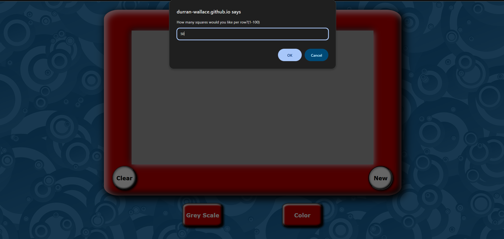
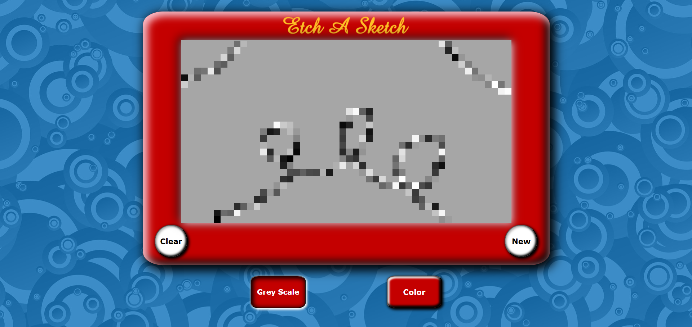
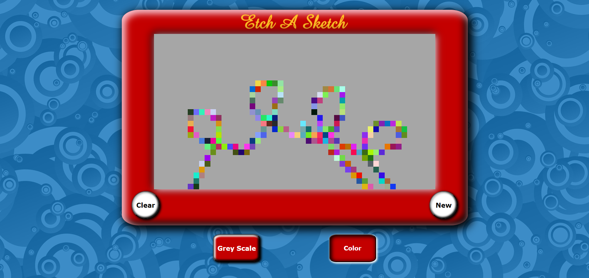
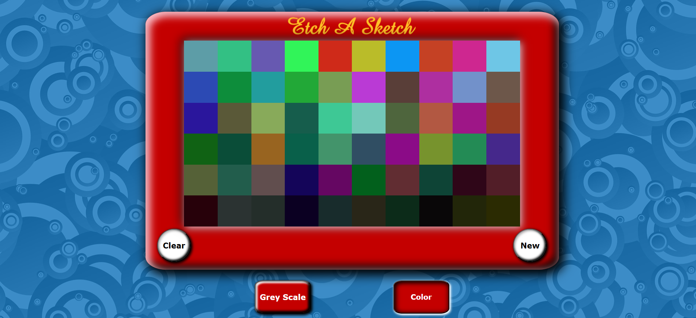
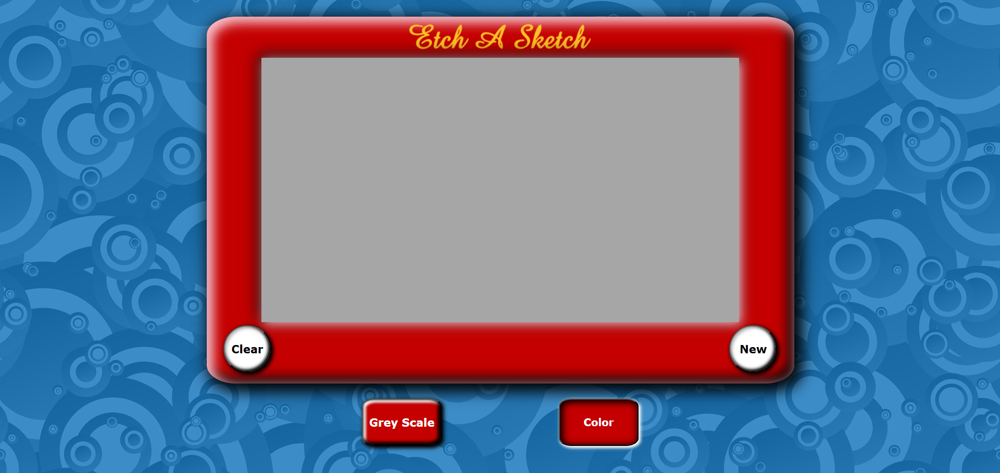

# Etch-a-Sketch

An interactive, web-based Etch-a-Sketch application built with HTML, CSS, and JavaScript. Draw freely on a grid of squares using your mouse, with options to reset, change colors, and adjust grid size.

---

## Features

- **Interactive Drawing:** Click and drag to draw on a grid of squares.  
- **Adjustable Grid:** Change the number of squares per side to create finer or coarser drawings.  
- **Color Options:** Draw using greyscale or random colors.
- **Reset Button:** Clear the entire canvas and start fresh.  
- Note: This app is optimized for desktop and tablet screens. On smaller devices, zooming out may be required for proper display.

---

## Technologies Used

- **HTML** – structure of the grid and controls  
- **CSS** – styling, hover effects, and responsive layout  
- **JavaScript** – interactive drawing logic, color selection, and dynamic grid generation  

---

## Screenshots / Demo

### 1. Adjustable Grid
  
*Figure 1: Change the grid size by choosing pixel count to create finer or more pixelated drawings.*

---

### 2. Greyscale Mode
  
*Figure 2: Choose grayscale and hover over canvas area to create your image.*

---

### 3. Color Mode
  
*Figure 3. Choose color and hover over canvas area to create your image.*

---

### 4. Shading
  
*Figure 4: Hover over the same area to shade pixels 10% darker*

---

### 5. Reset Canvas
  
*Figure 5: Click 'Clear' to shake clear the canvas, or 'New' to start over choosing your resolution*

---

## How to Use

1. Visit https://durran-wallace.github.io/Etchasketch/ in any modern web browser.  
2. Choose the number of pixels per row to adjust resolution.  
3. Use the controls to choose greyscale or color, then begin hovering over canvas area.
4. Click Clear to 'Clear' the canvas or 'New' to start over.  

---

## Optional Enhancements

- Save and export drawings as images  
- Mobile screen optimization. Currently works well with samsung s-pen after zooming to 50%.
